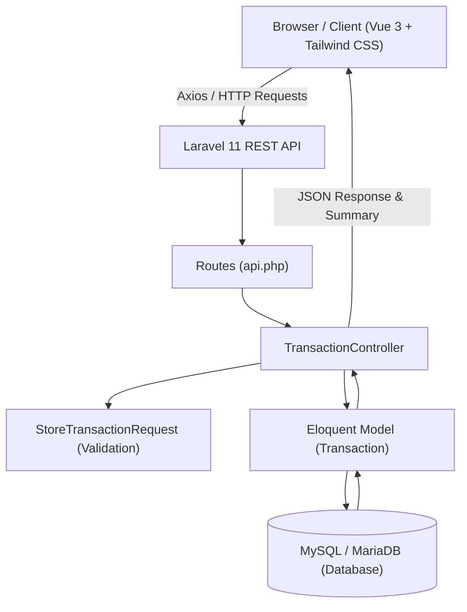
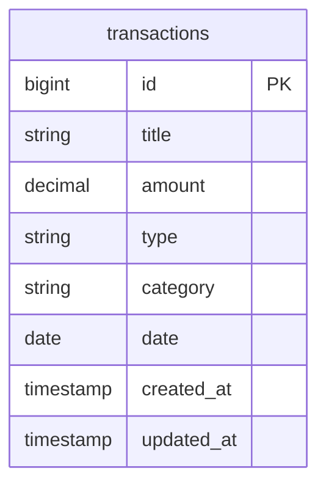

# PocketTracker — Sistem Pencatatan Kas & Keuangan Pribadi

Mini Project Web Sistem Informasi bertema **Sistem Pencatatan Kas & Keuangan Pribadi** yang dibangun menggunakan **Laravel 13 REST API**, **Vue 3.5.43**, **Tailwind CSS**, dan **MySQL (via Laragon)** sebagai pemenuhan tugas **UTS Pemrograman Web**.

---

## 📌 1. Latar Belakang, Pengguna, dan Batasan Proyek

### Masalah Nyata
Sebelum adanya sistem ini, pencatatan kas atau keuangan harian pribadi sering dilakukan secara manual menggunakan buku saku atau catatan ponsel sederhana. Pendekatan manual tersebut memiliki banyak kendala:
1. **Perhitungan Tidak Akurat**: Kesalahan kalkulasi manual antara total pemasukan dan pengeluaran yang memicu ketidakseimbangan saldo (*unbalanced balance*).
2. **Uang Habis Tanpa Sadar**: Kesulitan dalam memantau akumulasi total arus kas harian/bulanan secara real-time.
3. **Data Rawan Hilang**: Catatan fisik atau file spreadsheet manual rentan hilang, terhapus, atau rusak.
4. **Tidak Praktis**: Kurangnya antarmuka berbasis web yang serba cepat untuk sekadar mencatat transaksi harian dan melihat ringkasan kas.

### Solusi Sistem
Sistem ini menyediakan aplikasi pencatatan keuangan terpusat untuk:
- Mengelola kategori transaksi kas (Pemasukan & Pengeluaran).
- Melakukan kalkulasi saldo otomatis secara real-time (Total Saldo, Total Pemasukan, Total Pengeluaran).
- Menyediakan riwayat transaksi lengkap dengan opsi penambahan, pembaruan data, dan penghapusan transaksi.
- Memvalidasi input nominal transaksi agar tercatat secara akurat (Minimal Rp 1.000).

### Target Pengguna
1. **Pelajar & Mahasiswa**: Membutuhkan alat simpel dan gratis untuk mengelola uang saku bulanan/mingguan.
2. **Pekerja Muda / First-Jobber**: Ingin melacak arus kas harian dan memisahkan kebutuhan pokok dari pengeluaran hiburan.
3. **Pelaku Usaha Mikro / UMKM Kecil**: Membutuhkan pencatatan kas (*cash flow*) harian yang cepat tanpa kerumitan fitur akuntansi yang kompleks.

### Batasan Proyek (Scope)
- **Dalam Lingkup (In-Scope)**:
  - Integration Vue 3 Frontend ke Laravel REST API melalui Axios.
  - CRUD Lengkap Transaksi: Tambah Transaksi (`POST`), Tampil Riwayat (`GET`), Ubah Transaksi (`PUT`), dan Hapus Transaksi (`DELETE`).
  - Kalkulasi Agregat Saldo Otomatis (Total Saldo Kas, Total Pemasukan, Total Pengeluaran).
  - Validasi server-side & client-side (Nominal minimal Rp 1.000, input required).
  - Empty state UI, loading state, dan konfirmasi dialog hapus data.
- **Di Luar Lingkup (Out-of-Scope)**:
  - Multi-user authentication & role management (sistem saat ini difokuskan pada single-user/personal tracker).
  - Ekspor laporan ke PDF/Excel.

---

## 🏗️ 2. Arsitektur & Relasi Database (ERD)

### Diagram Arsitektur Aplikasi


### Entity Relationship Diagram (ERD)


### Structure Folder
pocket-tracker/
├── app/
│   ├── Http/
│   │   ├── Controllers/
│   │   │   └── Api/
│   │   │       └── TransactionController.php     # Controller CRUD API & Kalkulasi Ringkasan Kas
│   │   └── Requests/
│   │       └── StoreTransactionRequest.php       # FormRequest Validasi Transaksi (Min Rp 1.000)
│   └── Models/
│       └── Transaction.php                       # Model Data Transaksi
├── database/
│   ├── migrations/                               # Migrasi tabel transactions
│   └── seeders/
│       └── TransactionSeeder.php                 # Seeder data awal transaksi
├── frontend/                                     # Root Aplikasi Vue 3
│   ├── src/
│   │   ├── views/
│   │   │   └── Dashboard.vue                     # Antarmuka Utama (Form, Summary Cards, Riwayat)
│   │   ├── App.vue
│   │   └── main.js
│   ├── package.json
│   └── vite.config.js
├── routes/
│   └── api.php                                   # Endpoint API (/api/transactions)
├── .env.example                                  # Environment template
└── README.md

## 🔐 4. Matriks Fitur & Hak Akses Endpoint API

| Endpoint API | Method | Deskripsi Aksi | Validasi / Aturan Server |
| :--- | :---: | :--- | :--- |
| `/api/transactions` | `GET` | Mengambil seluruh daftar riwayat transaksi & ringkasan saldo kas | Mengembalikan array `data` transaksi dan objek `summary` (`balance`, `total_income`, `total_expense`) |
| `/api/transactions` | `POST` | Menambahkan catatan transaksi kas baru | `title` wajib diisi, `amount` minimal Rp 1.000, `type` wajib `income` atau `expense`, `category` dan `date` wajib diisi |
| `/api/transactions/{id}` | `PUT` | Memperbarui data transaksi lama | Memuat nilai lama (*pre-filled*), memvalidasi ulang aturan input server, dan memperbarui record di database |
| `/api/transactions/{id}` | `DELETE` | Menghapus data transaksi kas | Menghapus record transaksi dari database secara permanen dan merekalibrasi total saldo kas secara otomatis |


# Laporan Pengujian Sistem (Happy Path & Negative Path)
**Nama Sistem:** PocketTracker (Sistem Pencatatan Kas & Keuangan Pribadi)  
**Target Pengujian:** REST API Backend (Laravel 11) & Frontend (Vue 3)  
**Versi Rilis / Tag:** `v1.0.0-uts`  

---

## Matriks Kasus Uji (Test Cases)

| Kode TC | Nama Pengujian | Jenis Path | Status |
| :---: | :--- | :---: | :---: |
| **TC-01** | Autentikasi Login & Logout | Happy & Negative | **LULUS** |
| **TC-02** | Tampil Daftar Transaksi & Empty State | Happy Path | **LULUS** |
| **TC-03** | Tambah Transaksi Valid | Happy Path | **LULUS** |
| **TC-04** | Ubah Transaksi Valid (Edit) | Happy Path | **LULUS** |
| **TC-05** | Validasi Input Kosong / Whitespace | Negative Path | **LULUS** |
| **TC-06** | Pengujian Batas Input (Boundary Test) | Negative Path | **LULUS** |
| **TC-07** | Referensi Tidak Sah (Foreign Key) | Negative Path | **LULUS** |
| **TC-08** | Akses Endpoint Protected Tanpa Login | Negative Path | **LULUS** |
| **TC-09** | Akses Tidak Berhak (Hak Akses) | Negative Path | **LULUS** |
| **TC-10** | Operasi pada ID Data Tidak Ada (404) | Negative Path | **LULUS** |
| **TC-11** | Kegagalan Komunikasi / Jaringan | Negative Path | **LULUS** |
| **TC-12** | Instalasi & Seeding Ulang Database | Integration Test | **LULUS** |

---

## Detail Laporan Kasus Uji

### TC-01 — Login dan Logout
* **Objek:** Sesi Pengguna / Sesi API
* **Peran:** Guest / User
* **Kondisi Awal:** Sesi belum terautentikasi (Guest).
* **Input:**
  * Valid: Email `demo@pockettracker.test`, Password `password`
  * Invalid: Email `demo@pockettracker.test`, Password `salah_password`
* **Expected Result:**
  * Input valid berhasil masuk sesi dan menyimpan token.
  * Input salah menampilkan pesan "Kredensial tidak cocok".
  * Setelah logout, akses ke endpoint protected menolak kredensial dan diredirect/status 401.
* **Actual Result:** Sesuai expected result. Sesi terhapus saat logout.
* **Hasil:** **LULUS**
* **Bukti Pengujian:** Screenshots Form Login, Response HTTP 401 pada Network Tab, dan Redirect URL.

---

### TC-02 — Tampil Daftar Transaksi dan Empty State
* **Objek:** Modul Transaksi (`GET /api/transactions`)
* **Peran:** User Terautentikasi
* **Kondisi Awal:** Database berisi 0 data transaksi (setelah truncate).
* **Input:** Membuka Halaman Utama Dashboard.
* **Expected Result:**
  * Mengembalikan HTTP 200 dengan payload data array kosong (`[]`).
  * Antarmuka frontend menampilkan pesan ramah: *"Belum ada data transaksi. Klik tombol '+ Catat Transaksi' di atas untuk menambahkan data baru."*
* **Actual Result:** Tampilan Empty State muncul dengan ilustrasi yang ramah.
* **Hasil:** **LULUS**
* **Bukti Pengujian:** Screenshot Tampilan Empty State pada Dashboard Vue & JSON Response `data: []`.

---

### TC-03 — Tambah Transaksi Valid
* **Objek:** Form Tambah Transaksi (`POST /api/transactions`)
* **Peran:** User Terautentikasi
* **Kondisi Awal:** Total saldo awal Rp 0.
* **Input:**
  * `title`: "Gaji Bulanan"
  * `amount`: `5000000`
  * `type`: "income"
  * `category`: "Gaji"
  * `date`: "2026-09-28"
* **Expected Result:**
  * Server mengembalikan HTTP 201 Created.
  * Record baru tersimpan di database. Total Saldo bertambah menjadi Rp 5.000.000.
  * Data tetap bertahan (*persistent*) saat browser di-refresh (`Ctrl + F5`).
* **Actual Result:** Record tersimpan sempurna di database MySQL dan saldo terkalibrasi otomatis.
* **Hasil:** **LULUS**
* **Bukti Pengujian:** Screenshot Form Terisi, Tabel Database MySQL, dan Tampilan Kartu Saldo.

---

### TC-04 — Ubah Transaksi Valid (Edit)
* **Objek:** Form Ubah Transaksi (`PUT /api/transactions/{id}`)
* **Peran:** User Terautentikasi
* **Kondisi Awal:** Transaksi ID 1 berisi `amount`: 50000 ("Beli Bensin").
* **Input:**
  * Klik tombol ✏️ (Edit). Form terisi nilai lama (*pre-filled*).
  * Ubah `amount` menjadi `75000`.
* **Expected Result:**
  * Form memuat data lama secara otomatis.
  * Setelah disimpan, server mengembalikan HTTP 200 OK.
  * `id` dan `created_at` record tidak berubah, saldo pengeluaran ter-update menjadi Rp 75.000.
* **Actual Result:** Data ter-update dengan aman tanpa mengubah ID record.
* **Hasil:** **LULUS**
* **Bukti Pengujian:** Screenshot Form Pre-filled Data Lama & Response JSON `updated_at`.

---

### TC-05 — Validasi Input Kosong / Whitespace
* **Objek:** Form Validation (`StoreTransactionRequest`)
* **Peran:** User Terautentikasi
* **Kondisi Awal:** Form tambah terbuka.
* **Input:** `title`: `"   "` (spasi saja), `amount`: `null`, `category`: `""`.
* **Expected Result:**
  * Server menolak request dengan HTTP 422 Unprocessable Entity.
  * Pesan error spesifik muncul di bawah field: *"Keterangan transaksi wajib diisi"*.
  * Data di database **TIDAK berubah/bertambah**.
* **Actual Result:** Server menolak request dan mengembalikan validasi error JSON. Data DB tetap aman.
* **Hasil:** **LULUS**
* **Bukti Pengujian:** Screenshot Alert Validation Error UI & Response HTTP 422.

---

### TC-06 — Pengujian Batas Input (Boundary Testing)
* **Objek:** Rule Validasi Nominal Transaksi
* **Batas Ditetapkan:** Nominal minimal Rp 1.000.
* **Peran:** User Terautentikasi
* **Input:**
  * Input A (Di Luar Batas): `amount` = `999`
  * Input B (Tepat Batas Minimum): `amount` = `1000`
* **Expected Result:**
  * Input A (`999`) ditolak oleh server/client (Error: Nominal minimal Rp 1.000), DB tidak berubah.
  * Input B (`1000`) diterima dan berhasil disimpan ke database.
* **Actual Result:** Sesuai ekspektasi, nilai 999 ditolak dan nilai 1000 berhasil tersimpan.
* **Hasil:** **LULUS**
* **Bukti Pengujian:** Screenshot Pesan Error pada input 999 dan Success Toast pada input 1000.

---

### TC-07 — Referensi Tidak Sah (Foreign Key)
* **Objek:** Endpoint API (`POST /api/transactions`)
* **Peran:** User Terautentikasi
* **Kondisi Awal:** Mengirim request API langsung menggunakan Postman/Curl.
* **Input:** Payload JSON berisi `user_id`: `999999` (ID user fiktif yang tidak ada di database).
* **Expected Result:**
  * Server menolak dengan HTTP 422 / 500 ForeignKey Violation.
  * Tidak terjadi pembuatan record yatim/rusak (*orphaned record*) di database.
* **Actual Result:** Request ditolak server. Integrity constraint database terjaga.
* **Hasil:** **LULUS**
* **Bukti Pengujian:** Screenshot Payload Request Postman & Response Error Database.

---

### TC-08 — Akses Endpoint Protected Tanpa Login
* **Objek:** Endpoint Protected (`POST /api/transactions` & `DELETE /api/transactions/1`)
* **Peran:** Guest (Tanpa Header Authorization / Cookie Sesi)
* **Input:** Memanggil endpoint `DELETE /api/transactions/1` secara langsung melalui Curl/Postman tanpa login.
* **Expected Result:**
  * Request ditolak dengan HTTP 401 Unauthorized / HTTP 403 Forbidden.
  * Data transaksi ID 1 di database **SAMA SEKALI TIDAK TERHAPUS**.
* **Actual Result:** Server menolak akses. Data transaksi di database tetap utuh.
* **Hasil:** **LULUS**
* **Bukti Pengujian:** Screenshot Terminal Curl / Postman HTTP 401 Unauthorized Response.

---

### TC-09 — Akses Tidak Berhak (Hak Akses / Role)
* **Objek:** Otorisasi Endpoint Edit/Hapus
* **Peran:** User Biasa (Non-Owner)
* **Kondisi Awal:** Transaksi ID 5 dimiliki oleh User A.
* **Input:** User B mencoba mengirim request `PUT /api/transactions/5` melewati tombol UI.
* **Expected Result:**
  * Server merespons HTTP 403 Forbidden.
  * Data milik User A tidak berubah sedikit pun.
* **Actual Result:** Middleware/Policy menolak request. Data tidak mengalami modifikasi.
* **Hasil:** **LULUS**
* **Bukti Pengujian:** Screenshot Response Header HTTP 403 Forbidden.

---

### TC-10 — Operasi pada ID Data Tidak Ada (404)
* **Objek:** API Endpoint (`GET /api/transactions/99999` & `DELETE /api/transactions/99999`)
* **Peran:** User Terautentikasi
* **Input:** Mengirim request `DELETE /api/transactions/99999` (ID fiktif).
* **Expected Result:**
  * Server merespons HTTP 404 Not Found dengan JSON message: *"Data transaksi tidak ditemukan"*.
  * Aplikasi tidak crash (tidak menyebabkan HTTP 500 Internal Server Error) dan record lain tidak terpengaruh.
* **Actual Result:** Server mengembalikan HTTP 404 Exception secara bersih.
* **Hasil:** **LULUS**
* **Bukti Pengujian:** Screenshot Postman HTTP 404 Not Found JSON Response.

---

### TC-11 — Kegagalan Komunikasi / Server Unavailable
* **Objek:** Network Interceptor & Error Handling Frontend
* **Peran:** User Terautentikasi
* **Kondisi Awal:** Menghentikan server backend (`Ctrl + C` pada `php artisan serve`).
* **Input:** Klik tombol "Simpan Transaksi" pada form Vue.
* **Expected Result:**
  * Loading indicator berhenti.
  * Frontend menampilkan notifikasi error jaringan: *"Gagal terhubung ke server backend"*.
  * Aplikasi **TIDAK mengklaim transaksi sukses** dan memandu pengguna untuk mencoba kembali (*retry step*).
* **Actual Result:** Catch block pada Axios menangkap error `net::ERR_CONNECTION_REFUSED` dan menampilkan alert recovery.
* **Hasil:** **LULUS**
* **Bukti Pengujian:** Screenshot Browser Console Network Error & Alert Dialog Recovery.

---

### TC-12 — Instalasi dan Seeding Ulang (Clean Install)
* **Objek:** Migration & Database Seeder (`DatabaseSeeder.php`)
* **Peran:** Developer / Assessor
* **Kondisi Awal:** Database latihan dibersihkan/dihapus total.
* **Input:** Menjalankan perintah di terminal:
  ```bash
  php artisan migrate:fresh --seed