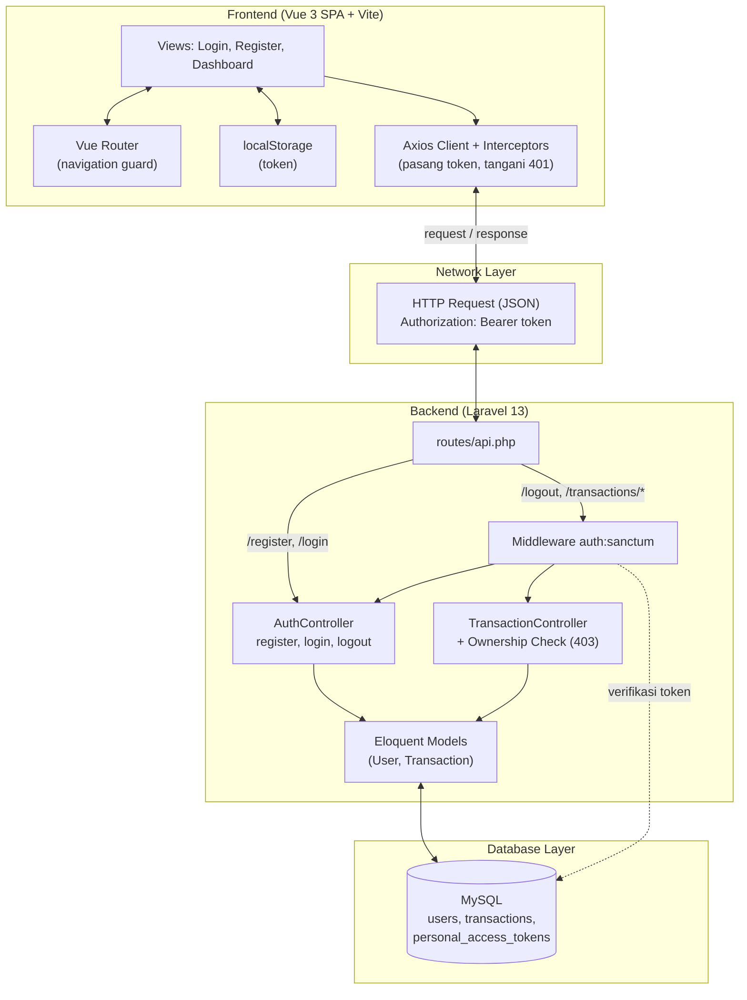
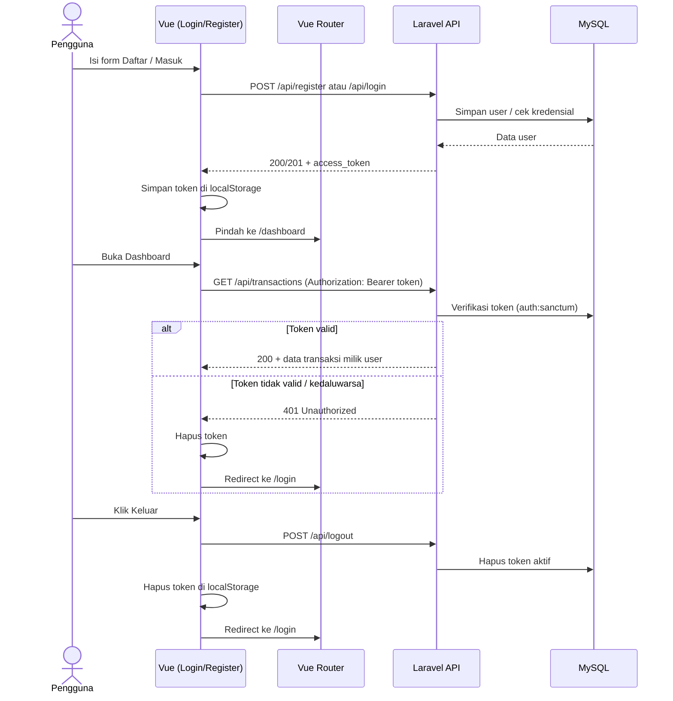
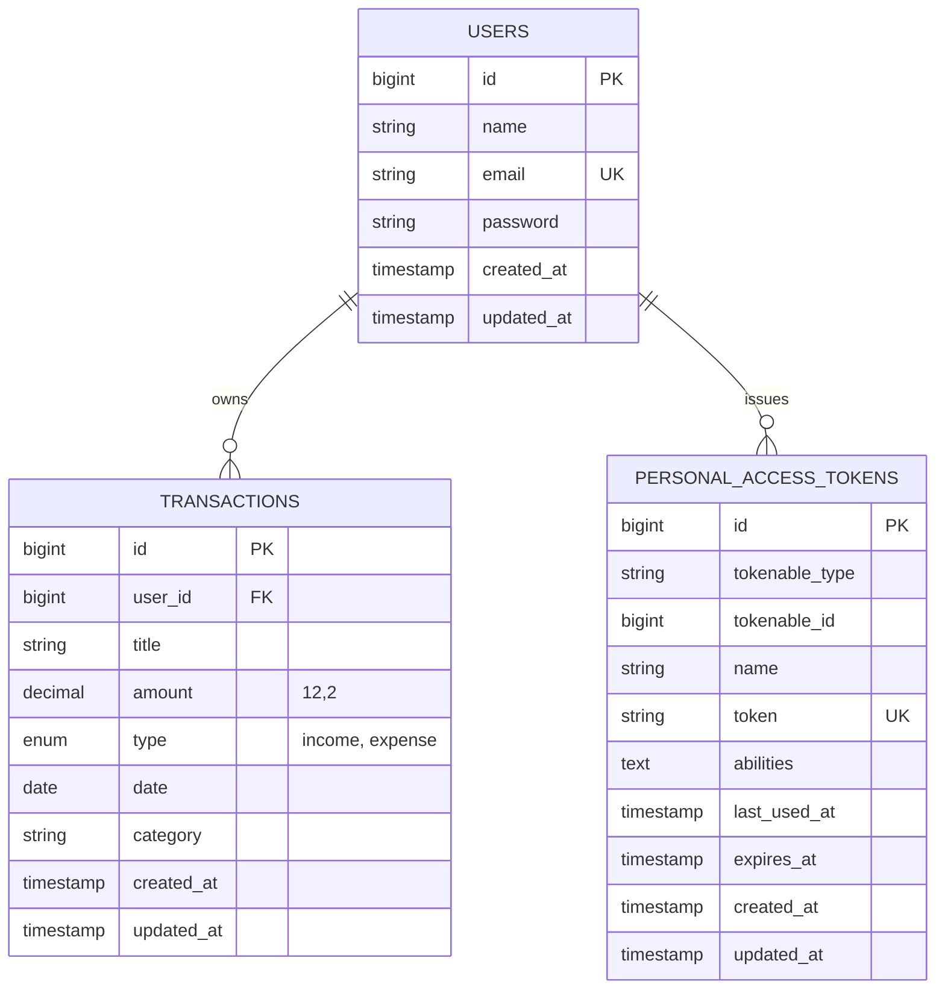

# PocketTracker — Sistem Pencatatan Kas & Keuangan Pribadi

Mini Project Web Sistem Informasi bertema **Sistem Pencatatan Kas & Keuangan Pribadi** yang dibangun menggunakan **Laravel 13 REST API** (autentikasi **Laravel Sanctum**), **Vue 3** (Vite + Vue Router), **Tailwind CSS**, dan **MySQL (via Laragon)** sebagai pemenuhan tugas **UTS Pemrograman Web**.

---

## 📌 1. Latar Belakang, Pengguna, dan Batasan Proyek

### Masalah Nyata
Sebelum adanya sistem ini, pencatatan kas atau keuangan harian pribadi sering dilakukan secara manual menggunakan buku saku atau catatan ponsel sederhana. Pendekatan manual tersebut memiliki banyak kendala:
1. **Perhitungan Tidak Akurat**: Kesalahan kalkulasi manual antara total pemasukan dan pengeluaran yang memicu ketidakseimbangan saldo (*unbalanced balance*).
2. **Uang Habis Tanpa Sadar**: Kesulitan memantau akumulasi total arus kas harian/bulanan secara real-time.
3. **Data Rawan Hilang**: Catatan fisik atau file spreadsheet manual rentan hilang, terhapus, atau rusak.
4. **Tidak Praktis**: Kurangnya antarmuka berbasis web yang cepat untuk mencatat transaksi harian dan melihat ringkasan kas.

### Solusi Sistem
Sistem ini menyediakan aplikasi pencatatan keuangan terpusat untuk:
- Mendaftar akun, masuk, dan keluar dengan aman menggunakan token (Laravel Sanctum).
- Mengelola transaksi kas (Pemasukan & Pengeluaran) milik masing-masing pengguna.
- Menghitung saldo otomatis secara real-time (Total Saldo, Total Pemasukan, Total Pengeluaran).
- Menampilkan riwayat transaksi lengkap dengan tambah, ubah, dan hapus data.
- Menampilkan ringkasan keuangan bulanan dan mengunduh data transaksi dalam bentuk CSV.
- Memvalidasi input nominal transaksi agar tercatat akurat (Minimal Rp 1.000).

### Target Pengguna
1. **Pelajar & Mahasiswa**: Membutuhkan alat simpel dan gratis untuk mengelola uang saku bulanan/mingguan.
2. **Pekerja Muda / First-Jobber**: Ingin melacak arus kas harian dan memisahkan kebutuhan pokok dari pengeluaran hiburan.
3. **Pelaku Usaha Mikro / UMKM Kecil**: Membutuhkan pencatatan kas (*cash flow*) harian yang cepat tanpa kerumitan fitur akuntansi.

### Batasan Proyek (Scope)
- **Dalam Lingkup (In-Scope)**:
  - Autentikasi: Registrasi, Login, dan Logout berbasis token (Laravel Sanctum).
  - Integrasi Vue 3 Frontend ke Laravel REST API melalui Axios, dengan proteksi halaman lewat Vue Router.
  - CRUD Transaksi: Tambah (`POST`), Tampil (`GET`), Ubah (`PUT`), dan Hapus (`DELETE`).
  - Data transaksi terikat ke pemilik (`user_id`); pengguna lain tidak dapat mengubah data yang bukan miliknya.
  - Kalkulasi agregat saldo otomatis, ringkasan bulanan, dan ekspor CSV.
  - Validasi server-side & client-side (nominal minimal Rp 1.000, input wajib diisi).
  - Empty state UI dan konfirmasi dialog hapus data.
- **Di Luar Lingkup (Out-of-Scope)**:
  - Manajemen peran (*role*) dan hak akses bertingkat (admin/user).
  - Verifikasi email dan pemulihan kata sandi (*forgot password*).
  - Ekspor laporan ke PDF/Excel.

---

## 🏗️ 2. Arsitektur, Alur, dan Relasi Database

### Diagram Arsitektur Aplikasi


### Diagram Alur Autentikasi


### Entity Relationship Diagram (ERD)


> Pada `PERSONAL_ACCESS_TOKENS`, kolom `tokenable_id` mengacu ke `users.id` melalui relasi polimorfik bawaan Laravel Sanctum.

### Struktur Folder
```
pocket-tracker-api/
├── app/
│   ├── Http/
│   │   └── Controllers/
│   │       ├── AuthController.php               # Register, Login, Logout
│   │       └── Api/
│   │           └── TransactionController.php    # CRUD, ringkasan saldo, grafik, ekspor CSV
│   └── Models/
│       ├── User.php
│       └── Transaction.php
├── database/
│   ├── factories/                               # UserFactory, TransactionFactory
│   ├── migrations/                              # users, transactions, personal_access_tokens
│   └── seeders/                                 # Seeder data awal
├── routes/
│   └── api.php                                  # Endpoint publik & terlindungi (auth:sanctum)
├── tests/
│   └── Feature/
│       └── TransactionApiTest.php               # TC-01 s.d. TC-12
├── frontend/                                    # Aplikasi Vue 3 (Vite)
│   ├── src/
│   │   ├── router/
│   │   │   └── index.ts                         # Rute + navigation guard
│   │   ├── views/
│   │   │   ├── Login.vue
│   │   │   ├── Register.vue
│   │   │   └── Dashboard.vue                    # Form, kartu saldo, grafik bulanan, riwayat
│   │   ├── App.vue                              # <RouterView />
│   │   └── main.ts
│   ├── package.json
│   └── vite.config.ts
├── diagrams/                                    # Sumber diagram Mermaid (.mmd)
├── .env.example
└── README.md
```

---

## ⚙️ 3. Cara Menjalankan Proyek

### Prasyarat
PHP ^8.3, Composer, Node.js, dan MySQL (mis. Laragon).

### Backend (Laravel)
```bash
composer install
cp .env.example .env
php artisan key:generate
# atur DB_DATABASE, DB_USERNAME, DB_PASSWORD di file .env
php artisan migrate --seed
php artisan serve          # http://localhost:8000
```

### Frontend (Vue)
```bash
cd frontend
npm install
npm run dev                # http://localhost:5173
```

### Akun
Daftar melalui halaman **Daftar** di aplikasi, atau gunakan akun demo dari seeder/test (`demo@pockettracker.test` / `password`) bila tersedia di database.

### Menjalankan Test
```bash
php artisan test
```
Pastikan `phpunit.xml` memakai database terpisah (mis. SQLite `:memory:`), karena `RefreshDatabase` menghapus isi database yang dipakai saat test.

---

## 🔐 4. Matriks Fitur & Hak Akses Endpoint API

| Endpoint API | Method | Akses | Deskripsi Aksi | Validasi / Aturan Server |
| :--- | :---: | :---: | :--- | :--- |
| `/api/register` | `POST` | Publik | Mendaftarkan akun baru dan mengembalikan token | `name` wajib, `email` valid & unik, `password` minimal 8 karakter dan sama dengan `password_confirmation` |
| `/api/login` | `POST` | Publik | Login dan mengembalikan `access_token` | `email` & `password` wajib; kredensial salah → 401 |
| `/api/logout` | `POST` | Token | Mencabut token yang sedang dipakai | Tanpa token → 401 |
| `/api/transactions` | `GET` | Token | Daftar transaksi & ringkasan saldo | Mengembalikan array `data` dan objek `summary` (`balance`, `total_income`, `total_expense`) |
| `/api/transactions` | `POST` | Token | Menambah transaksi baru | `title` wajib (bukan spasi saja), `amount` minimal 1.000, `type` = `income`/`expense`, `category` dan `date` wajib |
| `/api/transactions/{id}` | `PUT` | Token + pemilik | Memperbarui transaksi | Validasi ulang; bukan pemilik → 403; ID tidak ada → 404 |
| `/api/transactions/{id}` | `DELETE` | Token + pemilik | Menghapus transaksi | Bukan pemilik → 403; ID tidak ada → 404 |
| `/api/transactions/chart` | `GET` | Token | Ringkasan pemasukan & pengeluaran per bulan | Hanya data milik pengguna yang login |
| `/api/transactions/export` | `GET` | Token | Mengunduh transaksi dalam format CSV | Hanya data milik pengguna yang login |

---

# 🧪 Laporan Pengujian Sistem (Happy Path & Negative Path)

**Nama Sistem:** PocketTracker (Sistem Pencatatan Kas & Keuangan Pribadi)
**Target Pengujian:** REST API Backend (Laravel 13) & Frontend (Vue 3)
**Berkas Test:** `tests/Feature/TransactionApiTest.php`
**Versi Rilis / Tag:** `v1.0.0-uts`

## Matriks Kasus Uji (Test Cases)

| Kode TC | Nama Pengujian | Jenis Path | Status |
| :---: | :--- | :---: | :---: |
| **TC-01** | Autentikasi Login & Logout | Happy & Negative | **LULUS** |
| **TC-02** | Tampil Daftar Transaksi & Empty State | Happy Path | **LULUS** |
| **TC-03** | Tambah Transaksi Valid | Happy Path | **LULUS** |
| **TC-04** | Ubah Transaksi Valid (Edit) | Happy Path | **LULUS** |
| **TC-05** | Validasi Input Kosong / Whitespace | Negative Path | **LULUS** |
| **TC-06** | Pengujian Batas Input (Boundary Test) | Negative Path | **LULUS** |
| **TC-07** | Referensi Tidak Sah (Foreign Key) | Negative Path | **LULUS** |
| **TC-08** | Akses Endpoint Protected Tanpa Login | Negative Path | **LULUS** |
| **TC-09** | Akses Tidak Berhak (Hak Akses) | Negative Path | **LULUS** |
| **TC-10** | Operasi pada ID Data Tidak Ada (404) | Negative Path | **LULUS** |
| **TC-11** | Kegagalan Komunikasi / Jaringan | Negative Path | **LULUS** |
| **TC-12** | Instalasi & Seeding Ulang Database | Integration Test | **LULUS** |

## Detail Laporan Kasus Uji

### TC-01 — Login dan Logout
* **Objek:** Sesi Pengguna / Sesi API
* **Peran:** Guest / User
* **Kondisi Awal:** Sesi belum terautentikasi (Guest).
* **Input:**
  * Valid: Email `demo@pockettracker.test`, Password `password`
  * Invalid: Email `demo@pockettracker.test`, Password `salah_password`
* **Expected Result:**
  * Input valid berhasil masuk dan menerima `access_token`.
  * Input salah menampilkan pesan "Kredensial tidak cocok".
  * Setelah logout, akses ke endpoint protected ditolak dengan status 401.
* **Actual Result:** Sesuai expected result. Token dicabut saat logout.
* **Hasil:** **LULUS**
* **Bukti Pengujian:** Screenshot form login, response HTTP 401 pada tab Network, dan redirect ke `/login`.

### TC-02 — Tampil Daftar Transaksi dan Empty State
* **Objek:** Modul Transaksi (`GET /api/transactions`)
* **Peran:** User Terautentikasi
* **Kondisi Awal:** Pengguna belum memiliki transaksi.
* **Input:** Membuka halaman Dashboard.
* **Expected Result:**
  * HTTP 200 dengan `data` berupa array kosong (`[]`).
  * Antarmuka menampilkan: *"Belum ada data transaksi. Klik tombol '+ Catat Transaksi' di atas untuk menambahkan data baru."*
* **Actual Result:** Empty state tampil sesuai harapan.
* **Hasil:** **LULUS**
* **Bukti Pengujian:** Screenshot empty state pada Dashboard dan JSON response `data: []`.

### TC-03 — Tambah Transaksi Valid
* **Objek:** Form Tambah Transaksi (`POST /api/transactions`)
* **Peran:** User Terautentikasi
* **Kondisi Awal:** Total saldo awal Rp 0.
* **Input:** `title`: "Gaji Bulanan", `amount`: `5000000`, `type`: "income", `category`: "Gaji", `date`: "2026-09-28"
* **Expected Result:**
  * Server mengembalikan HTTP 201 Created.
  * Record tersimpan di database dan Total Saldo menjadi Rp 5.000.000.
  * Data tetap ada setelah browser di-refresh.
* **Actual Result:** Record tersimpan dan saldo terkalkulasi otomatis.
* **Hasil:** **LULUS**
* **Bukti Pengujian:** Screenshot form terisi, tabel database, dan kartu saldo.

### TC-04 — Ubah Transaksi Valid (Edit)
* **Objek:** Form Ubah Transaksi (`PUT /api/transactions/{id}`)
* **Peran:** User Terautentikasi (pemilik data)
* **Kondisi Awal:** Transaksi milik pengguna berisi `amount`: 50000.
* **Input:** Klik ✏️ (Edit), form terisi nilai lama, ubah `amount` menjadi `75000` dan `title` menjadi "Beli Bensin".
* **Expected Result:**
  * Form memuat data lama secara otomatis.
  * Server mengembalikan HTTP 200 OK; `id` dan `created_at` tidak berubah.
* **Actual Result:** Data ter-update tanpa mengubah ID record.
* **Hasil:** **LULUS**
* **Bukti Pengujian:** Screenshot form pre-filled dan response JSON `updated_at`.

### TC-05 — Validasi Input Kosong / Whitespace
* **Objek:** Validasi Server-side
* **Peran:** User Terautentikasi
* **Input:** `title`: `"   "` (spasi saja), `amount`: `5000`, tanpa `type`, `category`, dan `date`.
* **Expected Result:**
  * HTTP 422 Unprocessable Entity dengan error pada field `title`.
  * Data di database tidak bertambah.
* **Actual Result:** Server menolak request dan mengembalikan JSON error validasi.
* **Hasil:** **LULUS**
* **Bukti Pengujian:** Screenshot alert validasi dan response HTTP 422.

### TC-06 — Pengujian Batas Input (Boundary Testing)
* **Objek:** Rule validasi nominal transaksi
* **Batas Ditetapkan:** Nominal minimal Rp 1.000.
* **Input:** Input A (di luar batas): `amount` = `999`; Input B (tepat batas): `amount` = `1000`
* **Expected Result:**
  * `999` ditolak (HTTP 422), database tidak berubah.
  * `1000` diterima (HTTP 201) dan tersimpan.
* **Actual Result:** Sesuai ekspektasi.
* **Hasil:** **LULUS**
* **Bukti Pengujian:** Screenshot pesan error pada input 999 dan hasil sukses pada input 1000.

### TC-07 — Referensi Tidak Sah (Foreign Key)
* **Objek:** Endpoint `POST /api/transactions`
* **Peran:** User Terautentikasi
* **Kondisi Awal:** Request dikirim langsung lewat Postman/Curl.
* **Input:** Payload berisi `user_id`: `99999` (tidak ada di database).
* **Expected Result:**
  * Server menolak dengan HTTP 422.
  * Tidak terbentuk record yatim (*orphaned record*).
* **Actual Result:** Request ditolak; integritas database terjaga.
* **Hasil:** **LULUS**
* **Bukti Pengujian:** Screenshot payload request dan response error.

### TC-08 — Akses Endpoint Protected Tanpa Login
* **Objek:** Endpoint terlindungi `auth:sanctum` (contoh: `GET /api/transactions`)
* **Peran:** Guest (tanpa header Authorization)
* **Input:** Memanggil endpoint tanpa token.
* **Expected Result:**
  * Ditolak dengan HTTP 401 Unauthorized.
  * Data di database tidak terpengaruh.
* **Actual Result:** Server menolak akses dengan status 401.
* **Hasil:** **LULUS**
* **Bukti Pengujian:** Screenshot Postman/Curl HTTP 401 dan output `php artisan route:list -v` yang menampilkan middleware `auth:sanctum`.

### TC-09 — Akses Tidak Berhak (Hak Akses)
* **Objek:** Otorisasi ubah/hapus transaksi
* **Peran:** User biasa (bukan pemilik)
* **Kondisi Awal:** Sebuah transaksi dimiliki User A.
* **Input:** User B mengirim `PUT /api/transactions/{id}` untuk transaksi milik User A.
* **Expected Result:**
  * Server merespons HTTP 403 Forbidden.
  * Data milik User A tidak berubah.
* **Actual Result:** Request ditolak dan data tetap utuh.
* **Hasil:** **LULUS**
* **Bukti Pengujian:** Screenshot response header HTTP 403 Forbidden.

### TC-10 — Operasi pada ID Data Tidak Ada (404)
* **Objek:** `DELETE /api/transactions/99999`
* **Peran:** User Terautentikasi
* **Input:** Menghapus transaksi dengan ID yang tidak ada.
* **Expected Result:**
  * Server merespons HTTP 404 Not Found.
  * Aplikasi tidak crash (bukan HTTP 500) dan record lain tidak terpengaruh.
* **Actual Result:** Server mengembalikan HTTP 404.
* **Hasil:** **LULUS**
* **Bukti Pengujian:** Screenshot Postman HTTP 404.

### TC-11 — Kegagalan Komunikasi / Server Error
* **Objek:** Penanganan error API dan Frontend
* **Peran:** User Terautentikasi
* **Kondisi Awal (API):** Request `GET /api/transactions?trigger_error=1`.
* **Kondisi Awal (Frontend):** Server backend dihentikan (`Ctrl + C` pada `php artisan serve`).
* **Input:** Klik tombol "Simpan Transaksi" pada form Vue.
* **Expected Result:**
  * Struktur response error tetap valid (status 200, 422, atau 500).
  * Frontend menampilkan notifikasi gagal dan tidak mengklaim transaksi berhasil.
* **Actual Result:** Catch block Axios menangkap error jaringan dan menampilkan alert.
* **Hasil:** **LULUS**
* **Bukti Pengujian:** Screenshot console Network Error dan alert pemulihan.

### TC-12 — Instalasi dan Seeding Ulang (Clean Install)
* **Objek:** Migration & Database Seeder
* **Peran:** Developer / Assessor
* **Kondisi Awal:** Database latihan dibersihkan total.
* **Input:** Menjalankan perintah:
  ```bash
  php artisan migrate:fresh --seed
  ```
* **Expected Result:**
  * Seluruh tabel (`users`, `transactions`, `personal_access_tokens`) terbentuk tanpa error.
  * Seeder berjalan dan aplikasi dapat dipakai kembali.
* **Actual Result:** Migrasi dan seeding berhasil.
* **Hasil:** **LULUS**
* **Bukti Pengujian:** Screenshot output terminal dan isi tabel database.

---

## 🖼️ 5. Mengunduh Diagram sebagai Gambar

Sumber diagram tersedia di folder `diagrams/` (`arsitektur.mmd`, `alur-autentikasi.mmd`, `erd.mmd`). Untuk mengekspor ke PNG/SVG:

- **Online:** buka [mermaid.live](https://mermaid.live), tempel isi file `.mmd`, lalu pilih **Actions → PNG / SVG**.
- **CLI:**
  ```bash
  npm install -g @mermaid-js/mermaid-cli
  mmdc -i diagrams/arsitektur.mmd -o diagrams/arsitektur.png -s 2
  mmdc -i diagrams/alur-autentikasi.mmd -o diagrams/alur-autentikasi.png -s 2
  mmdc -i diagrams/erd.mmd -o diagrams/erd.png -s 2
  ```
